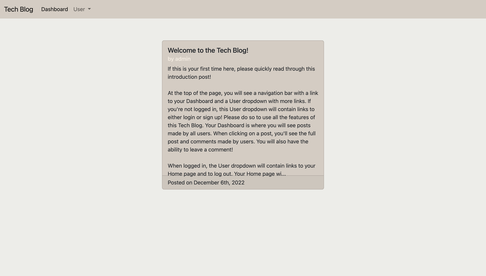

# Tech Blog

## Description

- This is a CMS-style blog site where users can publish articles, blog posts, etc.
- This project uses Express, MySQL, and an MVC style folder setup.

## Installation

N/A

## Usage

This website is deployed [here on Heroku](https://mysterious-temple-11766.herokuapp.com/)

Here is a screenshot of what the blog looks like!  

## Credits

N/A

## Features

Users can:

- Create and view own posts
- Edit and delete own posts
- View and comment on other posts